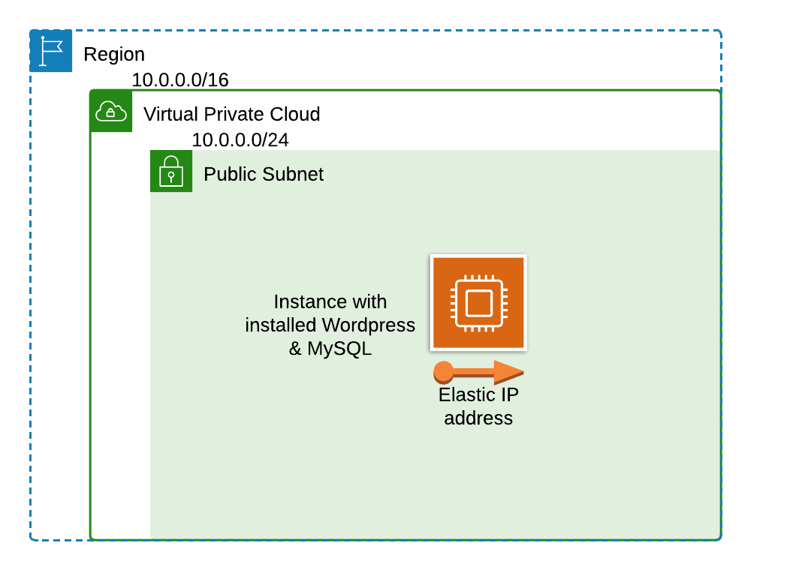

## Table of Contents
1. [Overview](#Overview)
2. [Tech Stack](#Tech-Stack)
3. [Architecture](#Architecture)
4. [Prerequisites](#Prerequisites)
5. [Usage](#Usage)
6. [Sample Runs](#Sample-Runs)
7. [Project Highlights](#Project-Highlights)
8. [Contributing](#Contributing)
9. [Issues](#Issues)
10. [License](#License)

## Overview
This is a simple Ansible playbook to provision an EC2 instance on AWS, setup a wordpress site, and create a MySQL database.

## Tech Stack
- Ansible
- AWS

## Architecture


## Prerequisites
1. Install Ansible
    ```
    $ ansible --version

    ansible [core 2.16.6]
      config file = None
      configured module search path = ['/home/saeed/.ansible/plugins/modules', '/usr/share/ansible/plugins/modules']
      ansible python module location = /home/saeed/.local/lib/python3.10/site-packages/ansible
      ansible collection location = /home/saeed/.ansible/collections:/usr/share/ansible/collections
      executable location = /home/saeed/.local/bin/ansible
      python version = 3.10.12 (main, Nov  6 2024, 20:22:13) [GCC 11.4.0] (/usr/bin/python3)
      jinja version = 3.1.4
      libyaml = True
    ```

2. amazon.aws ansible collection
    ```
    $ ansible-galaxy collection list amazon.aws

    # /home/saeed/.local/lib/python3.10/site-packages/ansible_collections
    Collection Version
    ---------- -------
    amazon.aws 7.5.0 
    ```

3. community.mysql collection
    ```
    $ ansible-galaxy collection list community.mysql          

    # /home/saeed/.local/lib/python3.10/site-packages/ansible_collections
    Collection      Version
    --------------- -------
    community.mysql 3.9.0 
    ```

4. Define the aws credentials at the `vars.yml` file:
    ```yaml
    access_key: <AWS-ACCESS-KEY-ID>
    secret_key: <AWS-SECRET-ACCESS-KEY>
    ```

## Usage
Make sure to modify the path to your private key file required for EC2 machine ssh.

1. Create the whole infrastructure
    ```bash
    ansible-playbook wordpress.yml -e "@vars.yml" -e ansible_python_interpreter=python3 -e ansible_host_key_checking=false --private-key=/home/saeed/.ssh/saeed_aws.pem
    ```

2. Stop the EC2 instance
    ```bash
    ansible-playbook stop_ec2.yml  -e "@vars.yml" -e ansible_python_interpreter=python3
    ```

3. Start the EC2 instance
    ```bash
    ansible-playbook start_ec2.yml  -e "@vars.yml" -e ansible_python_interpreter=python3
    ```

4. Delete the EC2 instance
    ```bash
    ansible-playbook delete_ec2.yml  -e "@vars.yml" -e ansible_python_interpreter=python3
    ```

## Sample Runs
1. Creation output
  

2. open the output url


## Project Highlights
- **Modularity**: Uses Ansible Roles for flexible configuration.
- **Persistence**: Employs MySQL database for data durability.
- **Speed**: Create the whole infrastructure with one command.

## Contributing
Contributions are welcome! To contribute:

1. Fork the repository.
2. Create a feature branch:
    ```bash
    git checkout -b feature-branch-name
    ```
3. Commit your changes:
    ```bash
    git commit -m "Add a new feature"
    ```
4. Push to your fork and submit a pull request.

## Issues
If you encounter any problems, please [create an issue](https://github.com/Ahmedelsa3eed/Ansible-EC2-Wordpress-MySQL/issues).

## License
This project is licensed under the MIT License. See the [LICENSE](https://github.com/Ahmedelsa3eed/Ansible-EC2-Wordpress-MySQL/blob/main/LICENSE) file for details.
